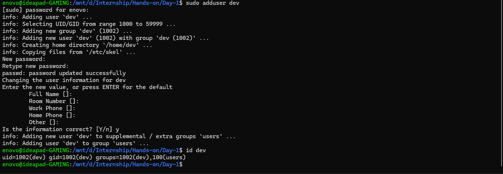
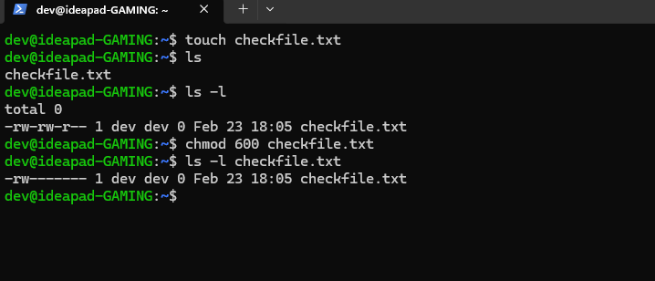
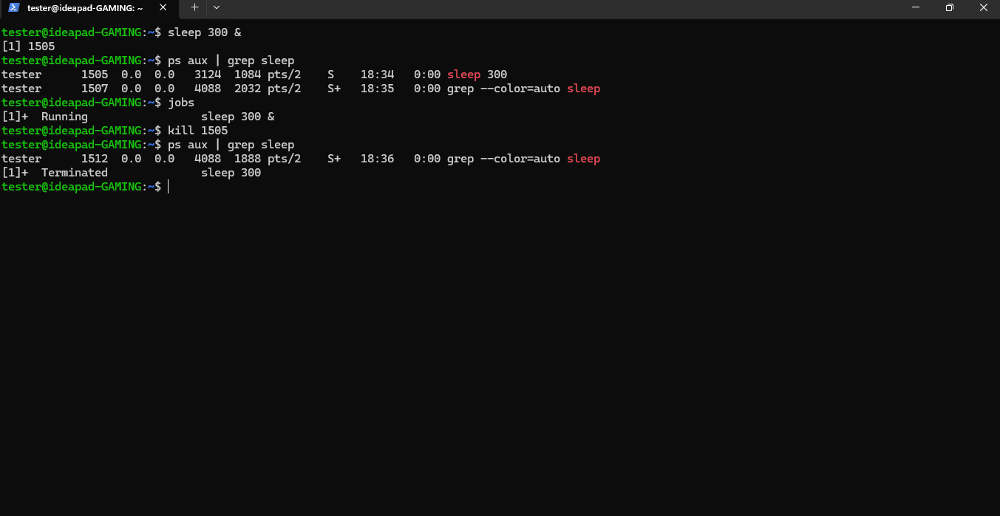
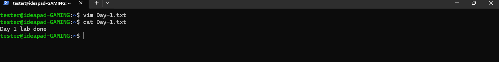

# Linux Hands-On Lab Day 1

## Day 1 covers fundamental Linux concepts required for DevOps and system administration:

1. User Management
2. File Permissions & Ownership
3. Process Control
4. Vim Basics

Environment: Ubuntu 24.04 (WSL2)

---

# Lab 1 User Management

## 1. Create User

```bash
sudo adduser dev
```
<p align="center">
  
</p>
## 2. Switch User

```bash
su - dev
whoami
pwd
```
<p align="center">
  
</p>


## 3. Verify Home Directory
```bash
ls -ld /home/dev
```
# Lab 2 File Permissions & Ownership
## 1. Create File
Login as dev and create a file:
```bash
touch checkfile.txt
ls -l
```
-rw-r--r--

## 2. Modify Permissions
Restrict file to owner only:
```bash
chmod 600 checkfile.txt
ls -l checkfile.txt
```
-rw-------

## 3. Create Another User
```bash
sudo adduser tester
```
## 4. Change Ownership
```bash
sudo chown tester:tester /home/dev/checkfile.txt
ls -l /home/dev/checkfile.txt
```
## 5. Test Access
```bash
su - tester
cat /home/dev/checkfile.txt
```
<p align="center">
  
</p>

# Lab 3 Process Control
##1. Run Background Process
```bash
sleep 300 &
```
## 2. Identify Process
```bash
ps aux | grep sleep
```
OR
jobs
## 3. Kill Process
```bash
kill <PID>
```
Verify termination:
```bash
ps aux | grep sleep
```
<p align="center">
  
</p>

# Lab 4 Vim Editor
## 1. Create File Using Vim
```bash
vim day1.txt
```
## 2. Insert Text
Press: i (for insertion)
Day 1 Lab done

Esc
Then :wq
```bash
cat Day1.txt
```
<p align="center">
  
</p>
